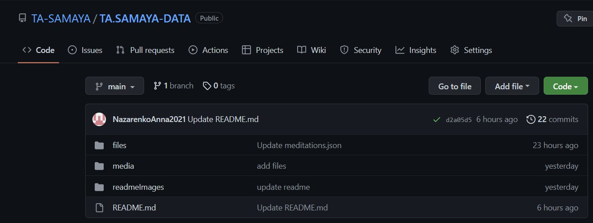

# TA.SAMAYA-DATA

## 1. Правила формата json:

1. {} -- определяет блок информации, к примеру курс
2. [] -- определяет набор информации (массив), к примеру медитации в курсе
3. "id": 0, -- это поле, в конце каждого поля запятая, не считая последнего
4. "text" -- все имена полей и строковые значения обязательно в двойных кавычках
5. 12345 -- числа без кавычек
6. true/false -- логические поля без кавычек и принимают значения true или false
7. null -- отсутствие значения, если строку оставить пустой, то будет тот же результат (строка с пробелом не пустая)

## 2. Как добавить/удалить данные:

### !!

### ВСЕ ДАННЫЕ ДОБАВЛЯЮТСЯ И УДАЛЯЮТСЯ В СООТВЕТСТВИИ С ИЗМЕНЕНИЯМИ В ФАЙЛАХ, КУРСЫ НЕ ПРОПАДАЮТ АВТОМАТИЧЕСКИ ПО ИСТЕЧЕНИЮ СРОКА, А ПРОСТО НЕ ВЫВОДЯТСЯ В СПИСКАХ, ИХ НУЖНО УДАЛЯТЬ ВРУЧНУЮ. ПРИ ОБНОВЛЕНИИ ДАННЫХ В ПРИЛОЖЕНИИ ОНИ ОБНОВЯТСЯ НЕ СРАЗУ, ТРЕБУЕТСЯ ОКОЛО 10 МИНУТ.

### !!

#### Данные берутся с ветки main:

#### Чтобы изменить их зайдите в папку files, выберите нужный вам файл и откройте редактирование:

### Добавить медитацию

В files/meditations.json в поле "data" размещены медитации, в приложении они отображаются по порядку и первая в списке медитация появится на главной. Для добавления новой нужно просто вставить внутри квадратных скобок медитацию, что имеет поля, соответствующие примеру.

    {
        "data":[
            {медитация},
            {медитация},
            {медитация},
        ]
    }

- Поле "id" любое целое число, должно быть уникальным
- Если поле "accessCode" оставить пустым или присвоить null, то медитация будет доступна без кода.
- Поле "durationMeasuring" принимает только следующие значения: minutes, hours, days.
- Если поле "banner" оставить пустым или присвоить null, то вместо него будет установлено изображение по умолчанию. В противном случае оно принимает ссылку на изображение.
- Поле "startDate" -- это дата когда медитация станет видна пользователям, Заполнять в формате "полный_год-месяц-день". Если присвоить null, то временных ограничений не будет.
- Поле "availableDays" -- это количество дней действительности медитации, сравнивается с разницей даты, указанной в поле "startDate" и текущей даты, чтоб определить доступна ли медитация. Если присвоить null, то медитация будет видна 90 дней.
- Поле "lessonContent" -- это массив строк, то есть задания. Нумеровать не нужно, это делает приложение.
- Поле "media" -- это аудио или видео в зависимости от указанного типа в поле "type": "audio"/"video". в поле "uri" должен быть путь к видео/аудио, если его нет, то будет воспроизводится видео/аудио по умолчанию (его можно изменить, заменив файл defaultAudio.mp3, что находится в media/audio/defaultAudio.mp3 или defaultVideo.mp4, что находится в media/video/defaultVideo.mp4).

###### Пример медитации:

    {
    "id": 1,
    "title": "Learning how to do it right",
    "description": "I had spent ...",
    "duration": 10,
    "accessCode": "1111",
    "durationMeasuring": "minutes",
    "lessonTitle": "string",
    "banner": "",
    "lessonContent": [
        "Take a seat. Find place to sit that feels calm and quiet to you.",
        "Set a time limit. ...",
        "Notice your body. ...",
        "Feel your breath. ...",
        "Notice when your mind has wandered. ...",
        "Be kind to your wandering mind. ...",
        "Close with kindness. ...",
        "Take a seat. Find place to sit that feels calm and quiet to you.",
        "Set a time limit. ...",
        "Notice your body. ...",
        "Feel your breath. ...",
        "Notice when your mind has wandered. ...",
        "Be kind to your wandering mind. ...",
        "Close with kindness. ..."
    ],
    "media": {
        "uri": "",
        "type": "audio"
    },
    "availableDays": 90,
    "startDate": null,
    "isAvailable": true
    }

###### Как добавить видео, аудио или баннер для медитации?

В папке media есть соответствующие разделы в которые нужно размещать контент — видео файлы в папку video, аудио в audio, картинки в images. Все данные доступны по ссылке https://ta-samaya.github.io/TA.SAMAYA-DATA. Чтобы добраться до конкретного файла нужно дописать путь: https://ta-samaya.github.io/TA.SAMAYA-DATA/media/video/defaultVideo.mp4, если перейти по ссылке, то мы попадём на видео по умолчанию. Для того, чтобы добавить эти данные в медитацию, нужно вставить этот путь в поле "uri", которое в "media", указав нужный тип, если это аудио или видео контент:

    "media": {
        "uri": "https://ta-samaya.github.io/TA.SAMAYA-DATA/media/video/defaultVideo.mp4",
        "type": "video"
    }

или вставить в поле "banner", если это картинка для баннера:

    "banner": "https://ta-samaya.github.io/TA.SAMAYA-DATA/media/images/UMAI.jpg",

### Добавить курс

В files/practices.json в поле "data" размещены курсы, в приложении они отображаются по порядку и первый в списке курс появится на главной. Для добавления нового нужно просто вставить внутри квадратных скобок курс, что имеет поля, соответствующие примеру.

- Поле "id" любое целое число, должно быть уникальным
- Если поле "accessCode" оставить пустым или присвоить null, то курс будет доступна без кода.
- Поле "durationMeasuring" принимает только следующие значения: minutes, hours, days.
- Поле "startDate" -- это дата начала курса, курс станет виден пользователям когда настанет этот день. Заполнять в формате "полный_год-месяц-день". Если присвоить null, то временных ограничений не будет.
- Поле "availableDays" -- это количество дней действительности курса, сравнивается с разницей даты указанной в поле "startDate" и текущей даты, чтоб определить доступен ли курс. Если присвоить null, то курс будет виден 90 дней.
- Поле "content" -- это массив медитаций.

###### Пример курса:

    {
        "id": 0,
        "title": "Practice",
        "description": "It is practice",
        "duration": 2,
        "accessCode": "abc123",
        "durationMeasuring": 'days',
        "availableDays": 10,
        "startDate": "2022-11-01",
        "content": [
            {
                "id": 0,
                "title": "Day one",
                "description": "I had spent...",
                "duration": 10,
                "banner": "https://nebula.org/blog/wp-content/uploads/2020/08/woman-doing-yoga-at-sunset-1024x683.jpg",
                "accessCode": null,
                "durationMeasuring": "minutes",
                "lessonTitle": "string",
                "lessonContent": [
                    "Take a seat. Find place to sit that feels calm and quiet to you.",
                    "Set a time limit. ...",
                    "Notice your body. ...",
                ],
              "media": {
                    "uri": "",
                    "type": "video"
                },
                "availableDays": 90,
                "startDate": null,
                "isAvailable": true
            },
            {
                "id": 1,
                "title": "Day two",
                "description": "I had spent...",
                "duration": 15,
                "banner": "https://nebula.org/blog/wp-content/uploads/2020/08/woman-doing-yoga-at-sunset-1024x683.jpg",
                "accessCode": null,
                "durationMeasuring": "minutes",
                "lessonTitle": "string",
                "lessonContent": [
                    "Take a seat. Find place to sit that feels calm and quiet to you.",
                    "Set a time limit. ...",
                    "Notice your body. ...",
                ],
                "media": {
                    "uri": "https://nebula.org/blog/wp-content/uploads/2020/08/woman-doing-yoga-at-sunset-1024x683.jpg",
                 "type": "audio"
                },
                "availableDays": 90,
                "startDate": null,
                "isAvailable": true
            }
        ]
    }

### Добавить пользователя

В files/users.json в поле "data" размещены пользователи. Для добавления нового нужно просто вставить внутри квадратных скобок пользователя, что имеет поля, соответствующие примеру.

- Поле "id" любое целое число, должно быть уникальным
- все поля обязательны к заполнению.

###### Пример пользователя:

    {
        "id": 0,
       "login": "tasamaya",
        "password": "01234",
        "name": "Name"
    }

### Добавить баннер

В files/banners.json в поле "data" размещены баннеры. Для добавления нового нужно просто вставить внутри квадратных скобок баннер, что имеет поля, соответствующие примеру.

- Поле "id" любое целое число, должно быть уникальным
- все поля обязательны к заполнению.

###### Пример баннера:

    {
        "id": 3,
        "image": "https://www.kreedon.com/wp-content/uploads/2022/03/sunsetyoga-2_647_062115121022.jpg",
        "link": "https://www.kreedon.com/wp-content/uploads/2022/03/sunsetyoga-2_647_062115121022.jpg"
    }

## 3. Советы для удобства:

- Установите [GitHub Desktop](https://desktop.github.com/)
- Установите [Visual Studio Code](https://code.visualstudio.com/download), или любой другой редактор, он упростит заполнение файлов

#### Авторизуйтесь в GitHub Desktop:

### ==>

#### Откройте репозиторий в Visual Studio Code

#### После внесения изменений залейте их в репозиторий

1. Нажмите "Commit to main"

2. Нажмите "Push origin"

